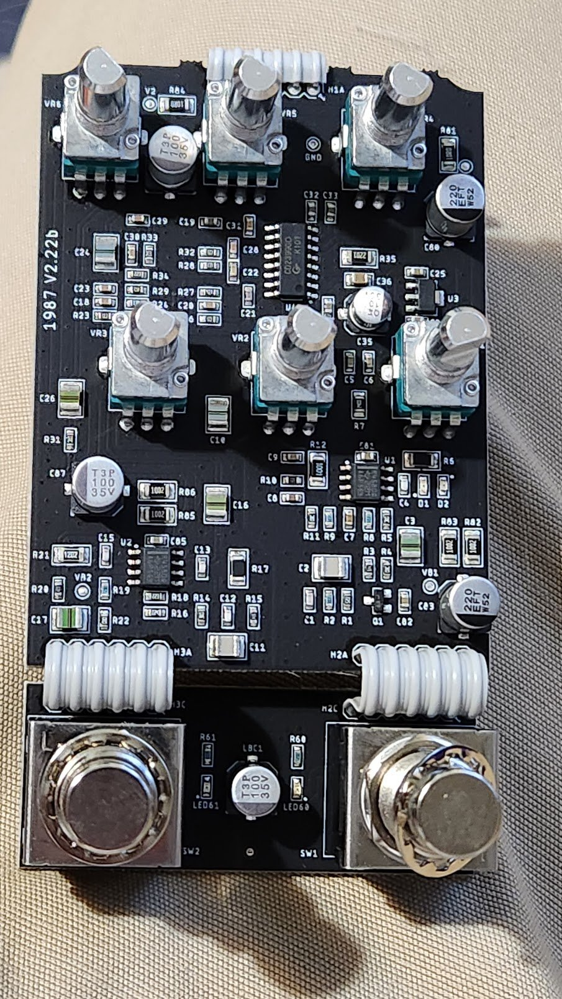
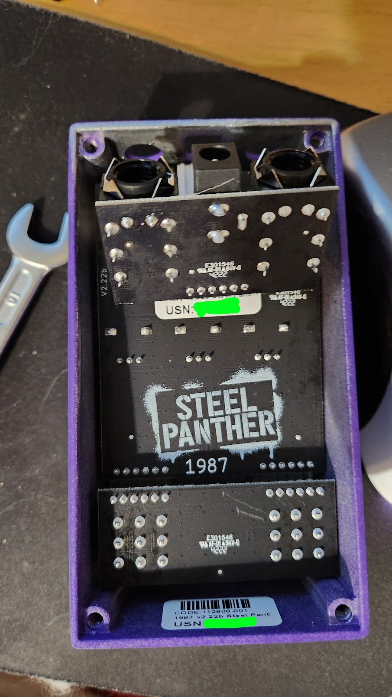
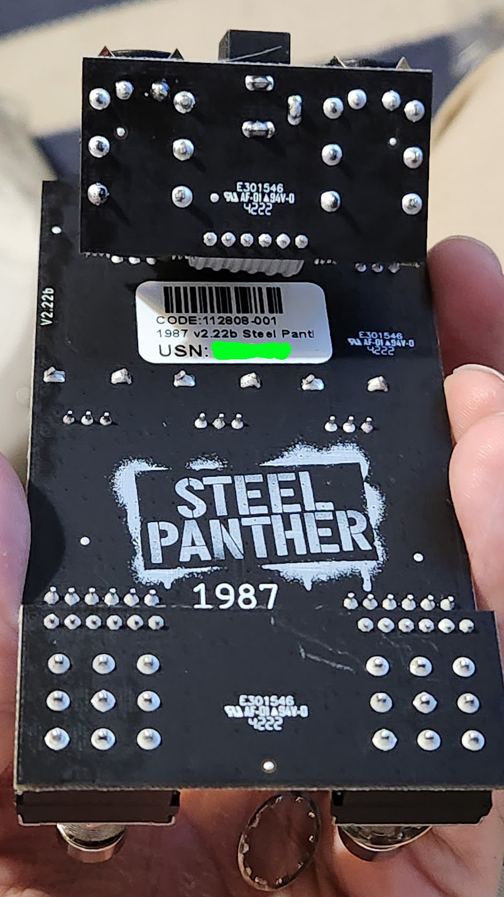
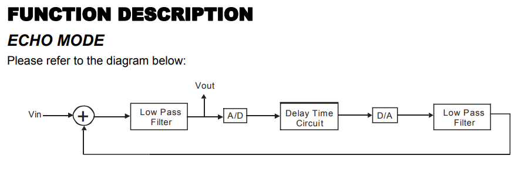
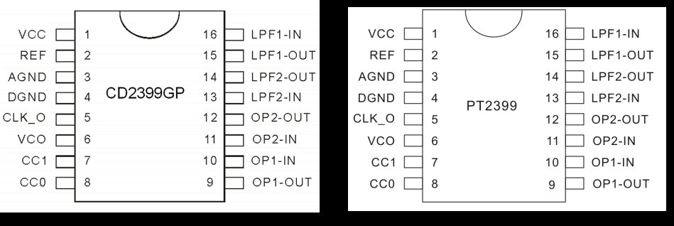
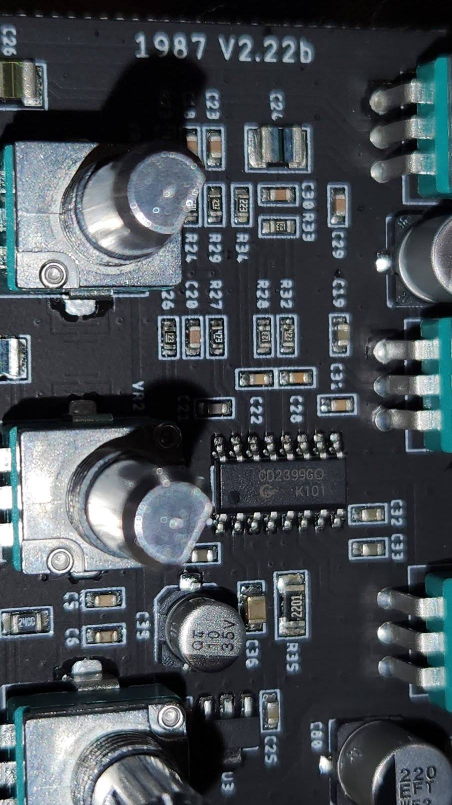
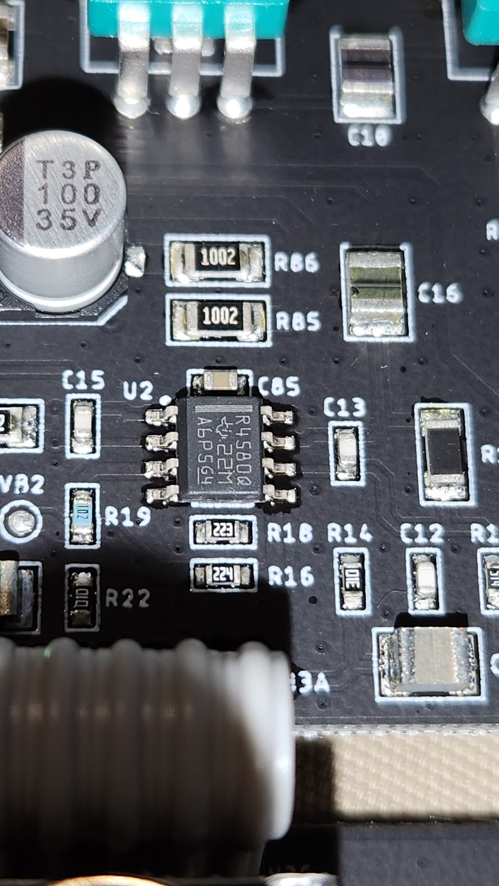



# PCB 

The Steel Panther 1987 is a new pedal that constists of delay and distortion.

There is not much information about the 1987 pedal yet. I have one, so I decided to look inside. 

I was mostly interested about the delay implementation.

### PCB front

### PCB back

### Delay

Delay is implemented using CD2399 chip. This is apparently the same as PT2399 chip, which I also have myself (but haven't used yet).

It contains 44kbits of RAM where the audio input is sampled to.

Resistor on Pin 6 and selects the delay length, which is connected to pedal's Delay pot. Datasheet states delay times between 31..342ms.

[PT2399 datasheet](https://electricdruid.net/datasheets/PT2399.pdf)

[Another highly informational analysis of PT2399](https://www.electrosmash.com/pt2399-analysis)

### Opamps

Pedal also contains two 4580 general-purpose audio opamps, which are quite similar to NE5532.

[RC4580 opamp datasheet](https://www.ti.com.cn/cn/lit/ds/symlink/rc4580-q1.pdf?ts=1688420715724).

