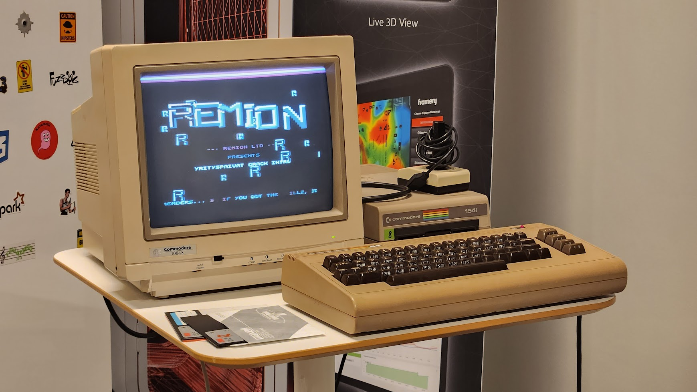

I made a simple Commodore 64 intro for a recruit expo.

The plan was to run the intro using original Commodore hardware, and use it to generate to some interest.

Unfortunately the intro didn't end up in the expo due to exhibition space limitations.

Intro was mostly coded in 6502 assembler with some C code.

The hardest thing was to generate a functional floppy using SD2IEC and Dracopy. It took about 20 attempts to get a 5.25" disk without any write errors.

[Demo on Youtube](https://youtu.be/QjtC-RqAv6M)