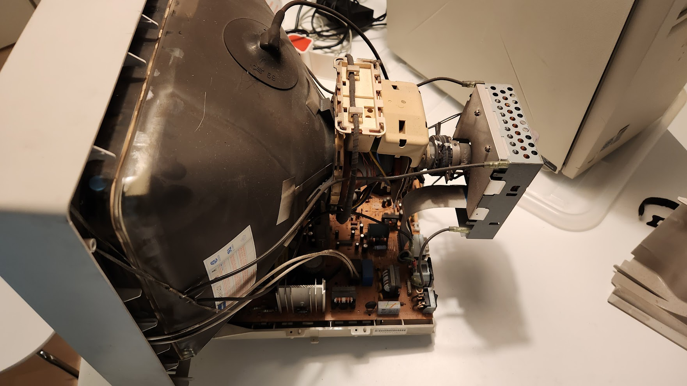
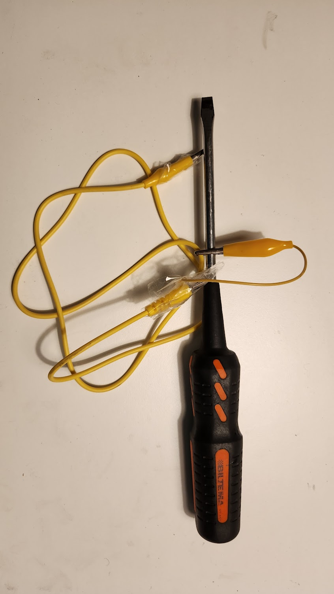
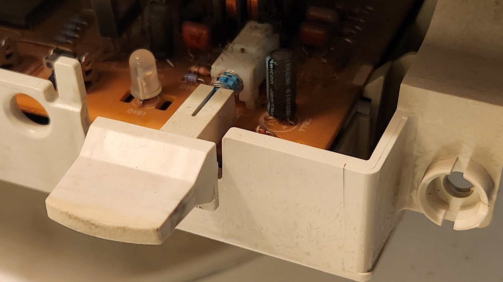
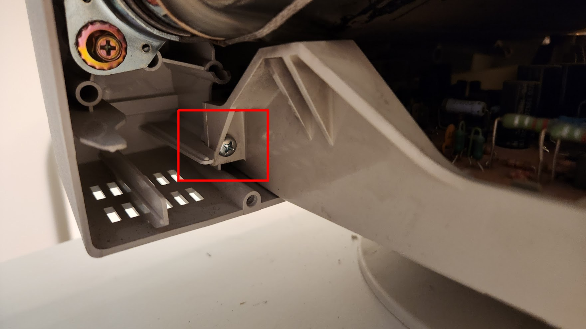
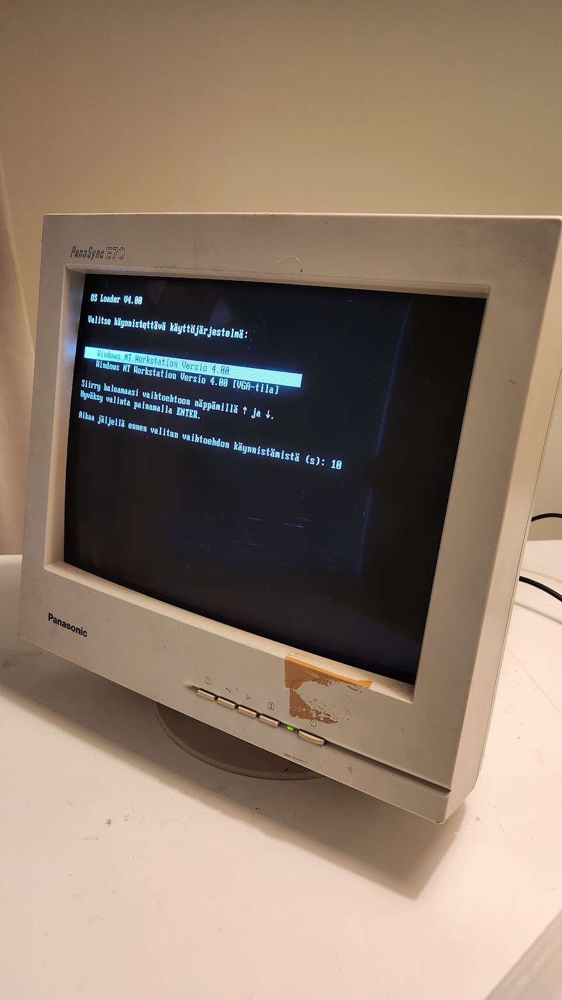



# Issue 

Monitor's ON/OFF button at the front panel did not latch to ON position, it had to be kept down manually for the monitor to stay ON.

# Repair

NOTE! Be very careful when working with CRT monitors! Don't do it unless you know what you're doing.

## Case opened

## Discharging the CRT

After opening the monitor, I used this DYI tool to discharge the monitor. It can be used to ground the screwdriver head.

[More info on Youtube](https://www.youtube.com/watch?v=0X28FX_XxtU)

## ON/OFF switch

Then I got the front panel off, and checked the ON/OFF switch.

It seemed to latch properly, so I just cleaned it with compressed air and IPA.

## Partial solution

After assemblying the monitor front panel (with a lot of effort), it seemed that the ON/OFF latching still didn't work.

It figured out that the switch is probably somewhat misaligned, and I tried to change the positioning by easening these two screws that link the plastic front panel to bottom panel.

Adjusting the screws and testing the switch did improve the situation, and the switch seemed to latch better. However after closing the case and testing it more, the issue somewhat returned.

But now it is possible to keep the monitor front panel ON/OFF switch constanty ON, which solves the issues for the most part. 

So the monitor can now be turned ON/OFF using the back ON/OFF power switch in the back.

## Up and running

