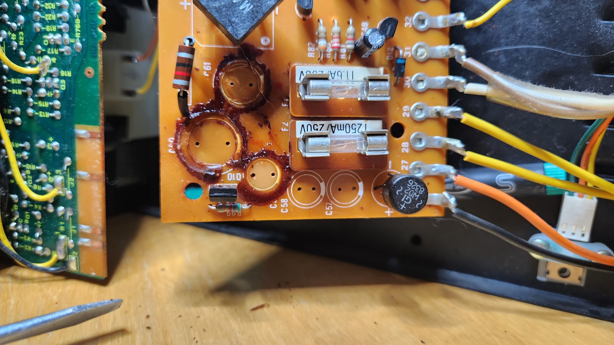
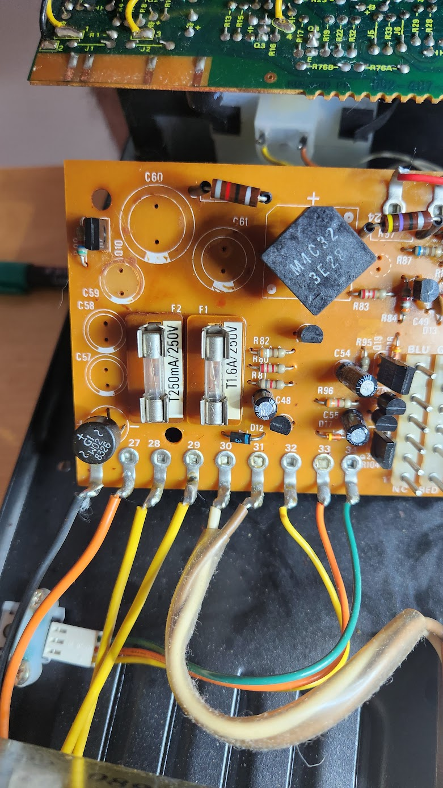
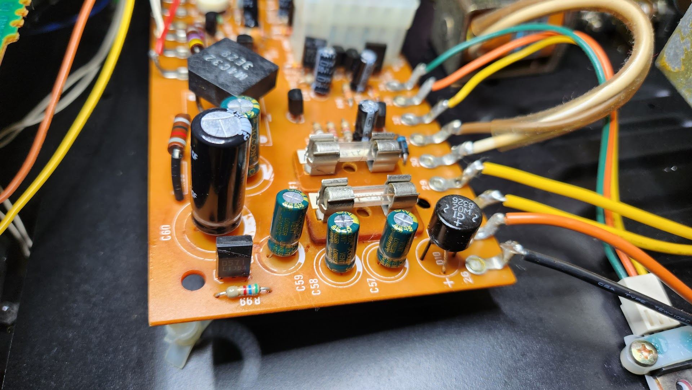
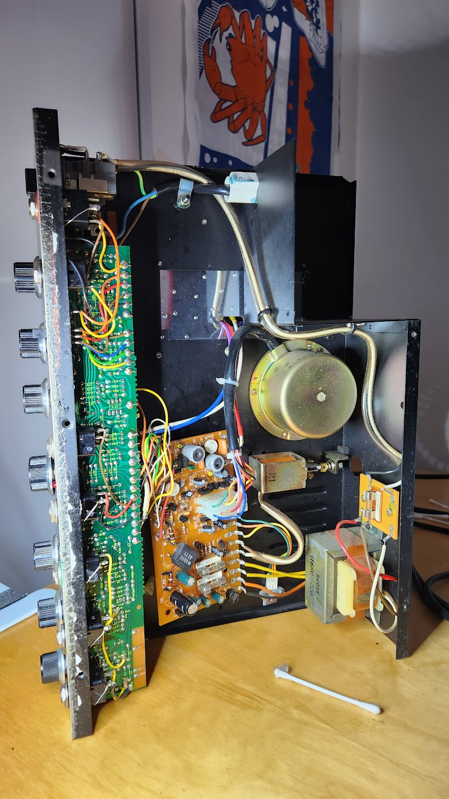
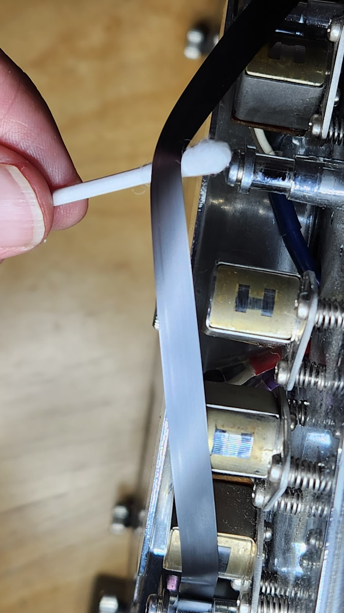



# Roland RE-150 Space Echo service

The Roland RE-150 Space Echo is a legendary tape echo unit that has played a significant role in shaping the sounds of countless musicians across the decades. However, like any vintage piece of equipment, it requires regular maintenance to ensure optimal performance. 

In this blog post, I will take you through the step-by-step process I followed to service my Roland RE-150 Space Echo. 

### Potentiometer Cleanup with PRF 7-78

Potentiometers, or pots, are used to control various parameters on the RE-150, such as echo intensity and repeat rate. Over time, these pots can accumulate dust and debris, leading to crackling sounds or erratic behavior. To address this issue, I used a specialized electronics cleaner called PRF 7-78.

1. Start by unplugging the RE-150 and removing its outer casing to gain access to the internal components.
2. Locate the potentiometers on the front panel and carefully spray PRF 7-78 into the small openings around the potentiometer shafts.
3. Rotate the pots back and forth several times to distribute the cleaner and remove any dirt or oxidation.
4. Allow the cleaner to evaporate completely before proceeding to the next step.

### Power Capacitor Recapping

Electrolytic capacitors are an essential component of the RE-150's power supply and can deteriorate over time, leading to noise issues or even failure. Recapitulating the power capacitors can significantly improve the unit's reliability and audio performance.

The power capacitors are:
- C60: 1000uF 25V
- C61: 1000uF 16V
- C59: 220uF 25V
- C57: 100uF 25V  
- C58: 100uF 25V 

1. Ensure that the RE-150 is unplugged from the power source.
2. Carefully identify the power capacitors on the circuit board.
3. Desolder the old capacitors one by one, taking note of their orientation to ensure proper replacement. Remove the glue residues.
4. Install the new capacitors in their respective positions, paying attention to the correct polarity.
5. Double-check all solder connections to ensure they are solid and free from any solder bridges.

#### Power caps removed

#### Glue removed

#### New caps installed

### PCB Cleaning

Over time, dust, grime, and oxidation can accumulate on the printed circuit board (PCB), affecting the unit's performance. Cleaning the PCB helps to maintain signal integrity and prevent potential issues.

1. Carefully remove the RE-150's PCB from its housing, taking necessary precautions to avoid damaging any components.
2. Using a can of compressed air, blow away loose dust and debris from the PCB surface.
3. Dip a soft-bristle brush in isopropyl alcohol and gently scrub the PCB, paying attention to areas with visible dirt or oxidation.
4. Allow the PCB to air dry completely before reassembling the unit.

### Magnetic Head Cleaning

The magnetic heads in the RE-150 are responsible for the characteristic echo effect. Over time, they can accumulate oxide buildup and dirt, resulting in degraded audio quality. Cleaning the magnetic heads is crucial for maintaining the unit's performance.

1. Carefully remove the protective cover over the magnetic heads, ensuring not to touch the heads themselves.
2. Moisten a cotton swab or lint-free cloth with isopropyl alcohol and gently clean the magnetic heads by applying light pressure.
3. Use a second clean swab or cloth to remove any residue left behind.
4. Allow the heads to air dry completely before reassembling the unit.

### Overall Cleanup
To complete the servicing process, a thorough overall cleanup of the RE-150 is necessary. This step involves cleaning the external casing, switches, and connectors.

1. Wipe the outer casing with a soft cloth slightly dampened with a mild cleaning solution. Avoid using harsh chemicals or cessive moisture.
2. Clean the switches and connectors using a contact cleaner or isopropyl alcohol.
3. Allow all components to dry completely before reassembling the unit.

*Disclaimer: ChatGPT was heavily used to generate the post!*
