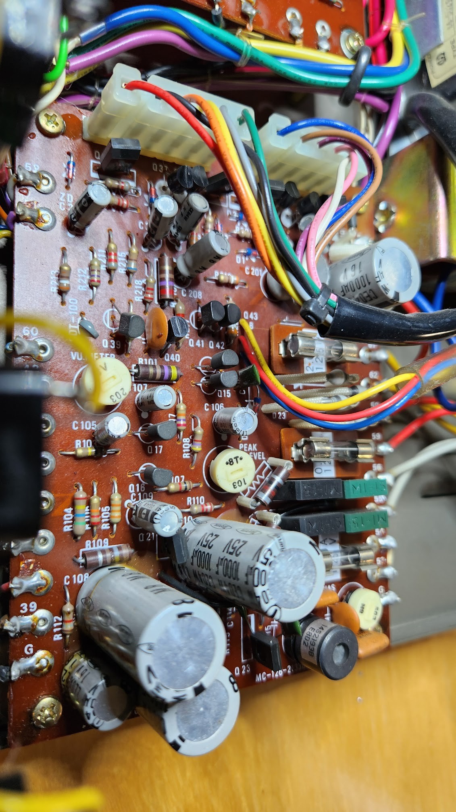
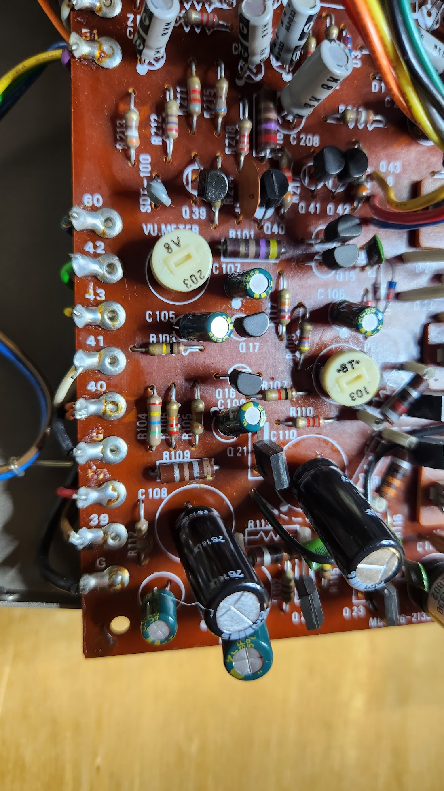
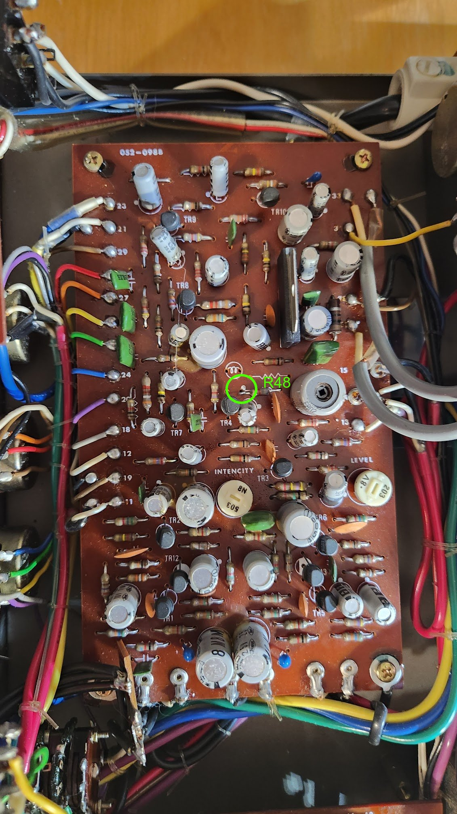

# Roland RE-201 Space Echo Repair & Service

## Overview

Issues at the beginning were:
- pots didn't work properly
- inputs were scratchy
- Echo was not heard

Service that I did:
- changed power board power caps
- Power board cleanup

## Power caps

In addition to unscrewing the power board, I also had to unscrew the transformer and cut one of the plastic ties to be able to install the new caps.

- C110, C108: 2x 1000uf 25V 
- C112, C113: 2x 1000uf 16V
- C111: 220uF 16V 
- C109, C106: 10uF 25V 
- C107: 1uF 50V 
- C105: 1uF 50V 
- C201: 100uF 50V  (from the Brushless motor circuit)

 

#### Old caps

### New caps installed

Small old caps were measured, they seemed good:
- 10uF: 11uF
- 10uF: 11uF
- 1uF 1.5uF
- 1uF: 1.3uF

- Power cap change didn't seem to change anything.

- Issue with the missing echo was that echo tape was put wrong way around. 

# Measurements

## Power board

Transformer measurements: 
- between pins 61-62 yellow: 15.5V AC
- between pins 55-56 grey: 11.4V AC
- between pins 58-59 red: 25V AC

Power:
- Pin 39: 9.3V 
- Pin 40: 16.1V

Solenoid:
- Between pins 44-45, 3.7V, 0.9VAC
- Between pins 44-46, 13.5V 

Brushless motor:
- Over C113 (between pins 45-49): 17V

Bias oscillator (for eraser & recording heads):
- Power pin 54 (ja echo pin XX) 
- Measured 65Vrms,  "Reference data: bias voltage 50..60Vrms". 
- Frequency: 60kHz

## Echo board

Power:
- Pin 16: 16.2v, should be 17V according to service manual?

- at R48 the Vrms should measure 2.45V. Was measured first at 2.47V
  

## Heads

- TODO: Videos coming later

 

## Misc Schema notes

In schematic there are these abbrevations:

- eh: eraser head
- phX: playhead X
- rh: record head

 

## Useful links

[Roland RE 101 Space Echo restoration and refurbish- disassembly, cap replacement, tape making etc.](https://www.youtube.com/watch?v=BH1fZEOoUpc)
