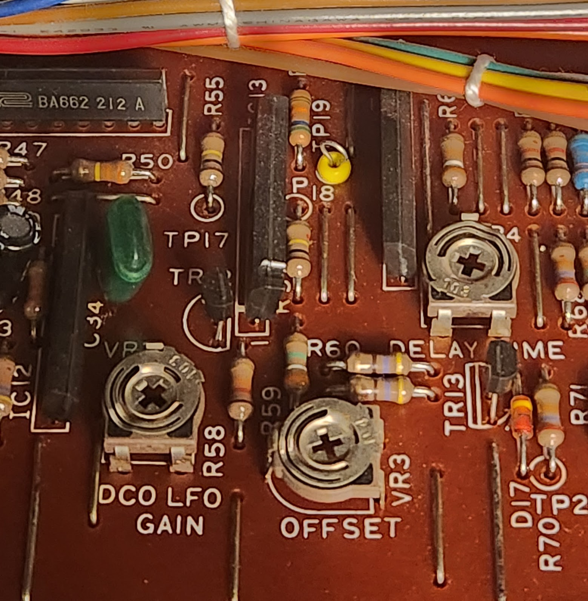



# Issues

- LFO trigger button wasn't working
- LFO DCO slider was affecting tuning, and was inproperly placed
- Tuning pot wasn't centered and was at maximum position
- Release slider was not functioning properly
- Overall out-of-tune

# Other
- Replace dust covers

# Beginning

After opening the four screws on the wooden side panels, you can open the synth:

# Minerva JU-60

This unit contains the Minerva MIDI upgrade.

I didn't find the proper hardware information about this mod, so this was a bit difficult.

## Minerva CPU board
CPU board sits on top of the original CPU board.

Closeup:

## Minerva Bender board
This mixes the MIDI controls with the pitch wheel and LFO trigger(?). It consists of a TL082 two channel op amp.

# Bender board

Starting point

LFO trigger button wasn't working. I tried to press it hard, and then it worked. So the button itself was the problem and needed to be replaced.

Existing hacky DCO slider. It wasn't positioned correctly, and it was also logarithmic "B" (10k) and not linear "A" like the original.

Desoldered DCO slider and LFO trigger:

Bender was calibrated to for +- fifths by adjusting the VR1 and VR2 trimmers.

 DCO LFO affected the synth tuning when turned up, so first I tried to calibrate the DCO LFO. These trimmers are at Panel A.
 

These trimmers control the DCO LFO gain and offset.

Offset must be 45ms at maximum setting :??????????????????????

Gain Vpp must be 14.4V:??????????????????????

However, none of these fixed the LFO DCO tuning issue. Finally I decided to unplug the Minerva bender board, and it seemed to fix the problem.

Then I saw the two trimmers in the Minerva board, and decided to try what happens when they are adjusted.

And indeed the other trimmer helped to fix the tuning issue. However, the trimmer was extremely sensitive, and seemed to drift easily. I suppose a redesigned Minerva board with better trimmer range might make fix the problem and make them easier to adjust.

# New Release slider

New sliders are somewhat incompatible.........
https://www.youtube.com/watch?v=0d95DDagvV4
Legs are too short

# Partial calibration

## Master tuner bias

Measuring master tuner bias voltage:

Tuner pot at the back of the synth must be centered and then bias calibrated to 7.7V by trimming the L1 inductor using non-ferrite tool.

# Other

Battery case door wasn't properly in place. I didn't dare to touch it in order not to lose presets.

# Dust covers

Starting point:

Removed the existing covers with some IPA and cotton pads:

New ones installed. You need to use a small amount of glue to stick the covers into place.

