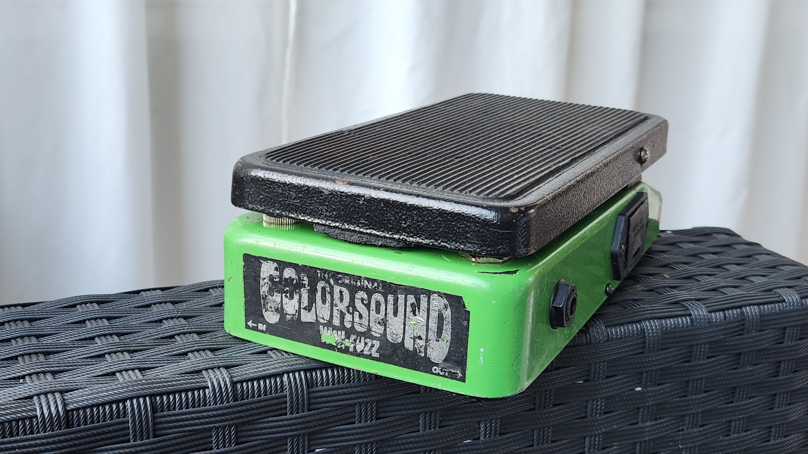
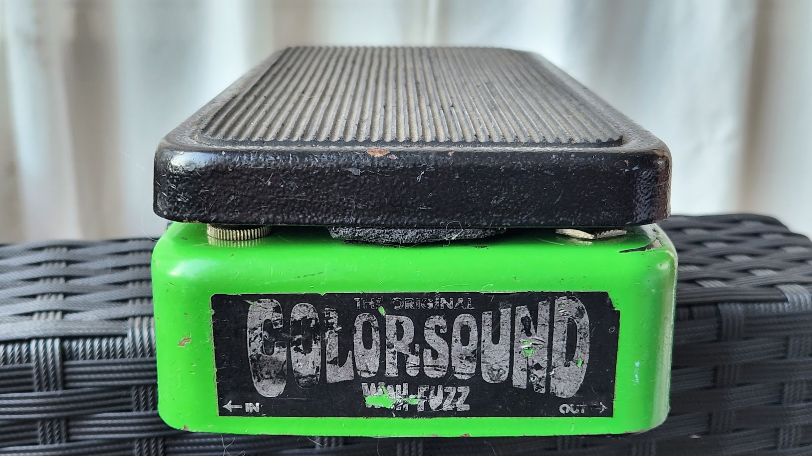
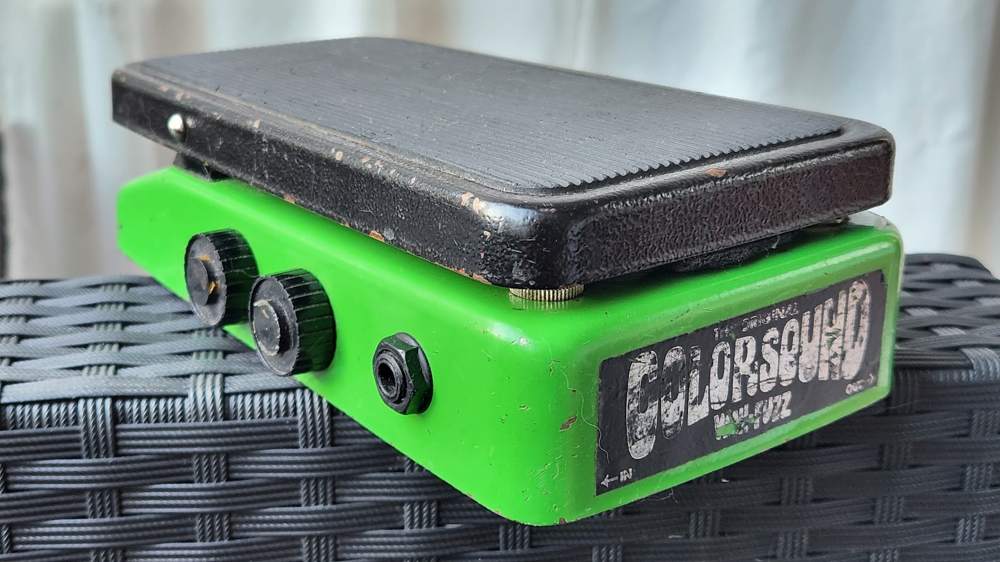
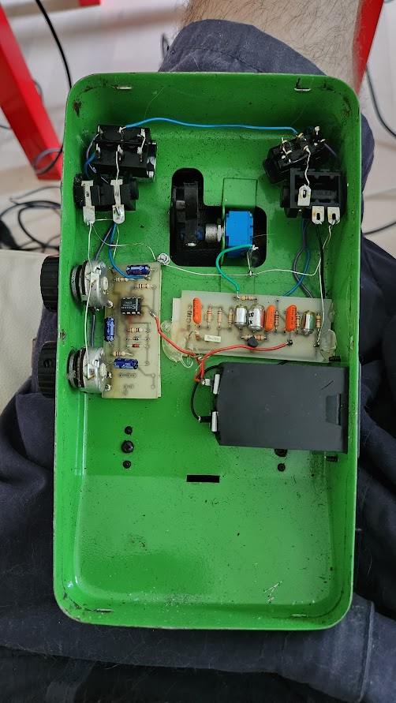
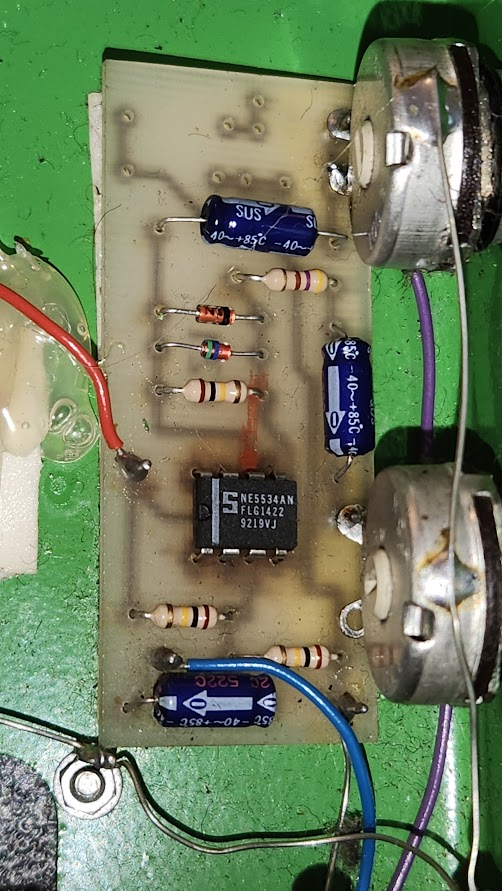
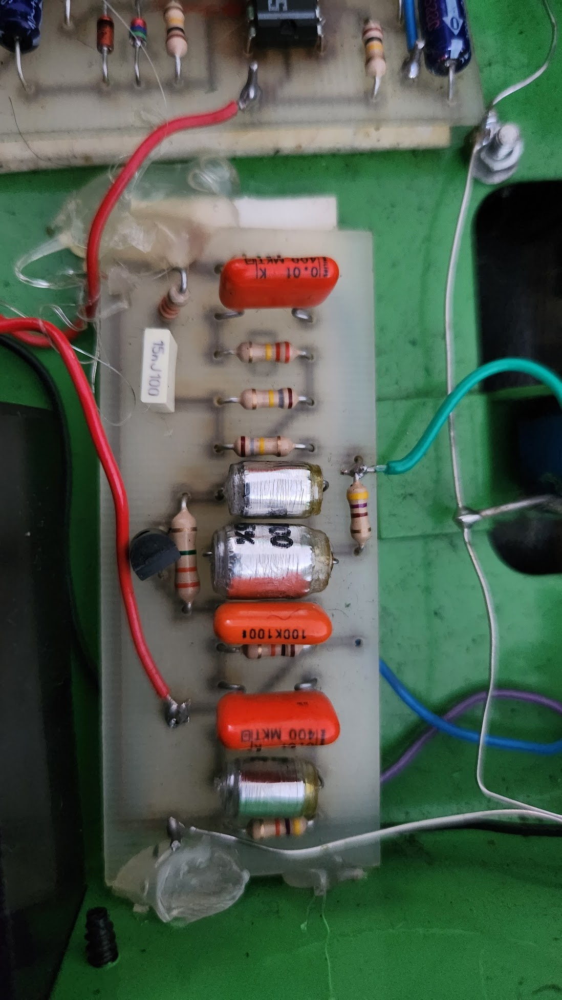
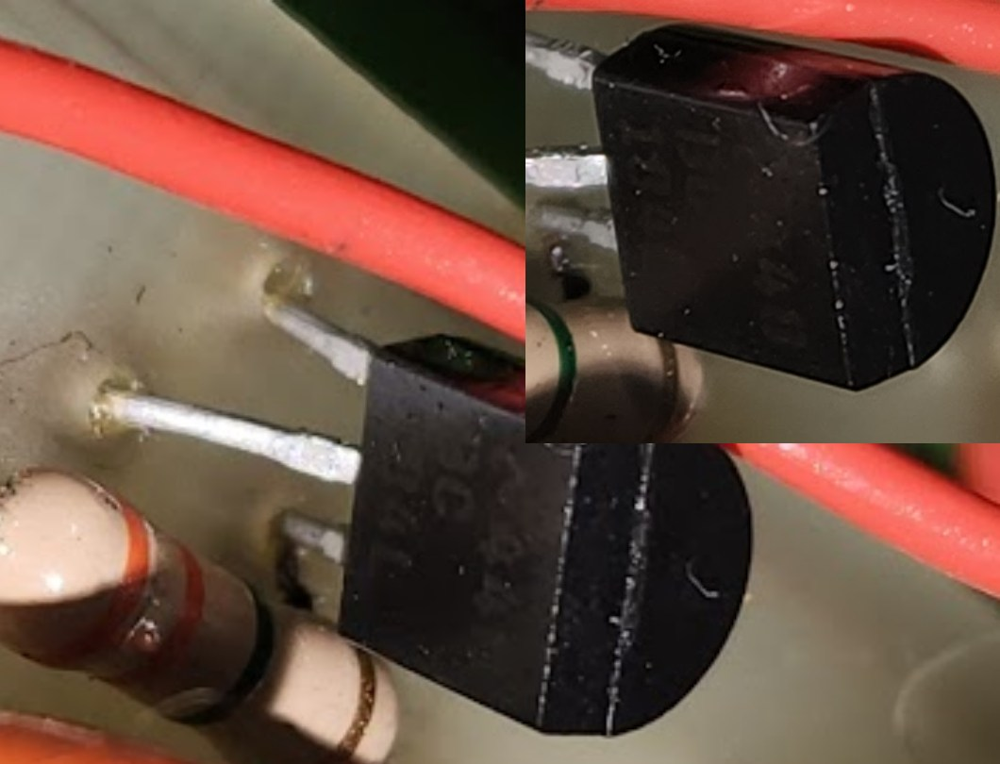



# Colorsound 

There are not that much PCB info for the this type of Colorsound pedal, which seems to be a reissue from the 1990s?

So I'll be adding some photos here.

One of the previous owners of this unit was apparently Ben Granfelt.

 

### Outside

Pots on the side control output VOLUME and FUZZ gain.

Left switch under footpedal controls WAH ON/OFF, and right switch is FUZZ ON/OFF.

 

### Bottom plate removed

Two screws on the side remove the bottom plate. It requires some effort to get the plate off.

### Fuzz

I didn't study the PCB in detail, but [internet](https://www.thegearpage.net/board/index.php?threads/the-fuzz-in-the-colorsound-wah-fuzz.1047836/) says:

 

_"If it's anything like the reissue I have (wide case, fuzz switch at heel, battery door on the side), the "fuzz" is an op amp>clipping diodes circuit. A similar circuit was also apparently used in some 90s Tone Benders and it shares more similarities with the MXR Distortion + than the 70s transistor circuit."_

Op amp is NE5534AN.

The NE5534 is a single op-amp package and it may require a compensation cap when used in the circuit, whereas the common NE5532 is a dual package and that compensation cap is internal. 

 

### Wah

Transistor seems to be BC184L NPN.

