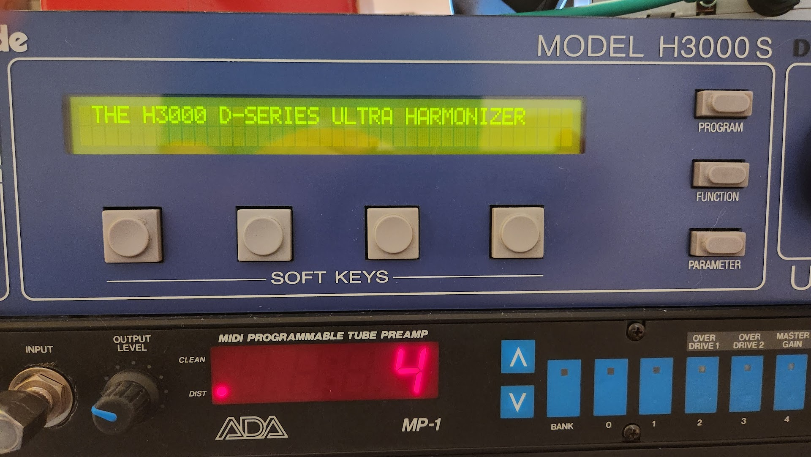
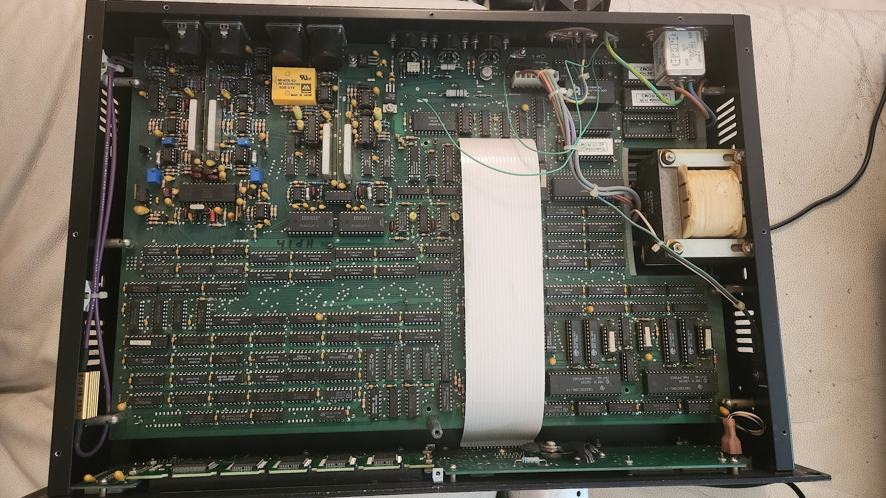
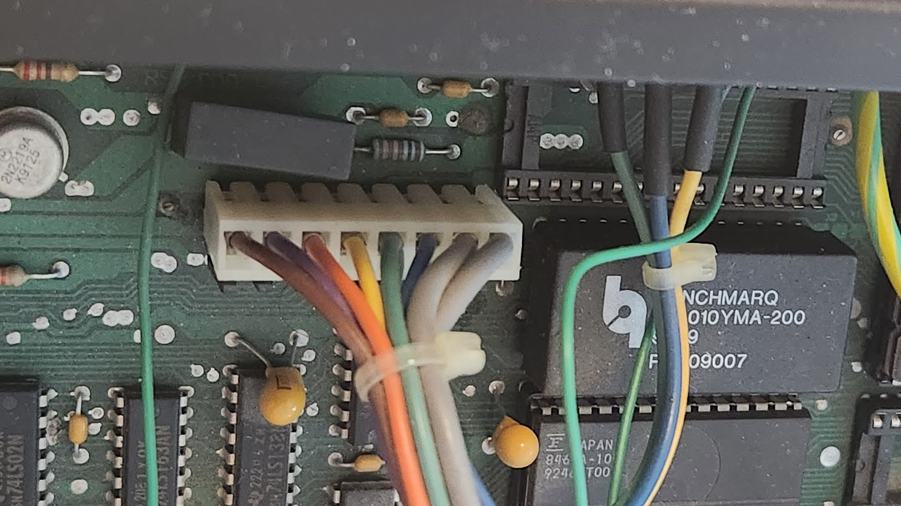



# Overview 

The audioscape of the 1980s and 1990s was heavily characterized by sounds that were once thought impossible. Ethereal reverbs, otherworldly delays, and pitch-shifted sonic landscapes that seemed to stretch the very fabric of reality itself were the order of the day. Behind many of these iconic sounds was a piece of gear that still resonates in the hearts of audio engineers and producers: the Eventide H3000.

Eventide, a company synonymous with cutting-edge sound processing, introduced the H3000 in the late '80s. The multi-effects processor quickly became a studio legend, known for its unrivaled pitch-shifting capabilities, intricate delay algorithms, and a slew of other effects that were simply ahead of its time. It found its place in countless classic records, lending its magic to vocals, guitars, and just about any instrument fed into it. To say that the H3000 was a game-changer would be an understatement.

### Problem

I had bought the H3000 about 6 months ago, and had used it without problems.

However, during one session the device just reset itself and refused to boot past the "THE H3000 D-SERIES ULTRA HARMONIZER", and then reset again.

Pressing and holding the FUNCTION key while switching power also didn't do anything, which normally stops boot and brings additional menu. So my suspect was power issue.

### Solution

I opened the device.

I googled the problem, and often the problem seems to be the white MOLEX power connector. I cleaned and sprayed it with PRF 7-78, and after that everything started to work again.

