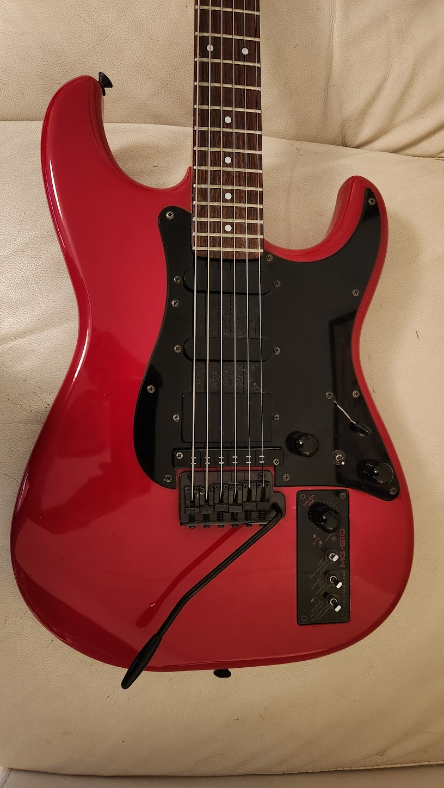
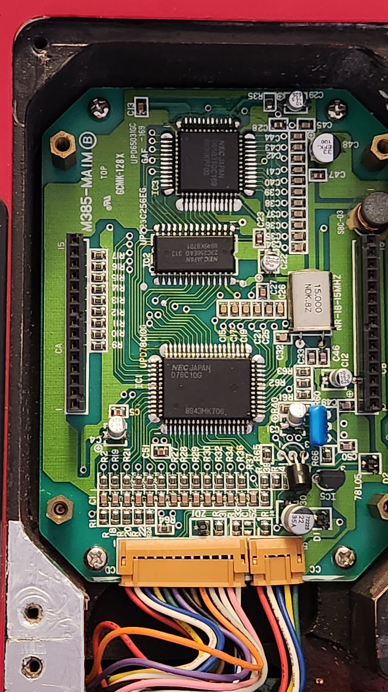
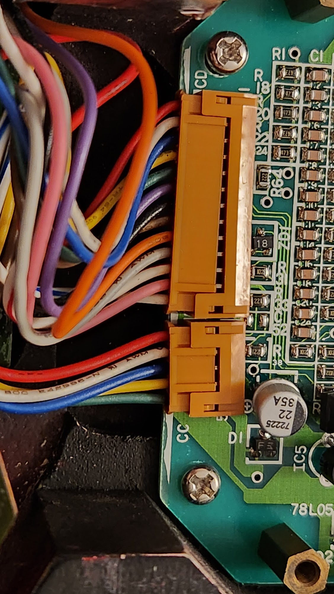
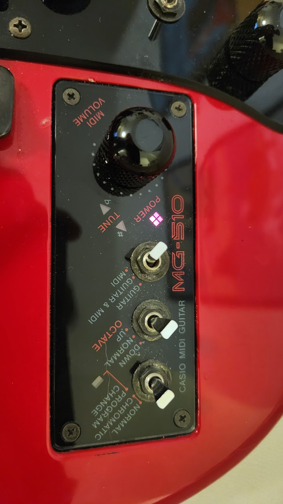
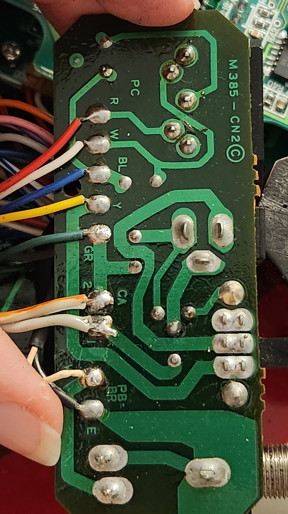
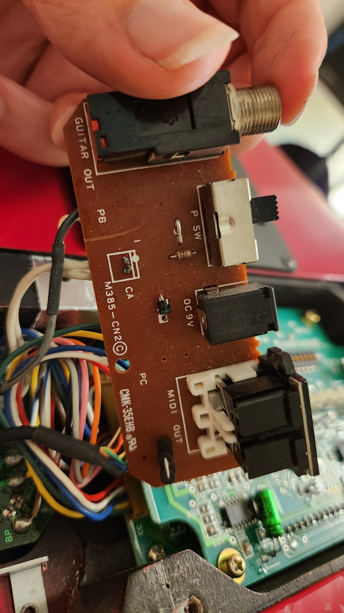
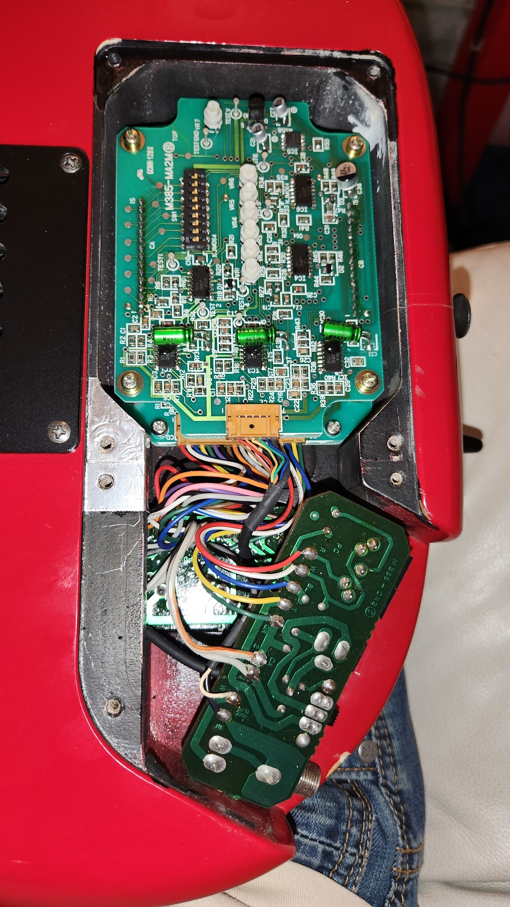
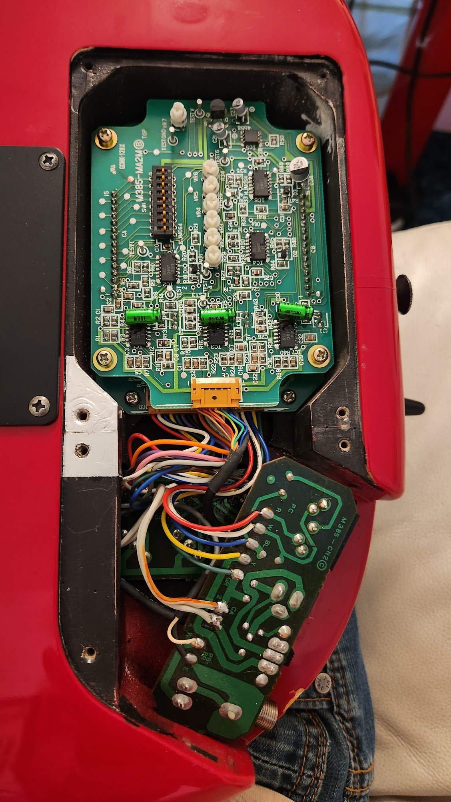



# Overview 

The 1980s wasn't just a decade of vibrant neon colors, wild hair, and iconic pop culture — it was a golden era for technological innovation, especially in the music industry. 

Amid the rise of synthesizers and drum machines, another intriguing hybrid made its mark in the music scene: the MIDI guitar. Among the leaders in this niche segment was the Casio MG-510, an instrument that merged the familiar physicality of a guitar with the vast sonic possibilities of MIDI.

Casio, a brand primarily recognized for calculators, watches, and digital pianos, took a leap into the world of guitars and embraced the emerging MIDI technology. Released in the late '80s, the MG-510 was not just any guitar – it was a digital powerhouse. 

With its built-in MIDI capabilities, it allowed guitarists to trigger synthesizers, drum machines, and other MIDI devices directly from their six-string. Imagine playing a grand piano riff, orchestral strings, or even synthesizer leads, all from the fretboard of your guitar!

### Problem

I bought this guitar, and detected a few issues.

Initially, the tuning LEDs and power LEDS were not working. After a bit of playing, MIDI switches also stopped working.

### Solution

The problem was luckily just a loose connector. 

After connecting it properly and spraying all connectors with PRF 7-78, the LEDs and controls now all work.

### Other PCB photos

