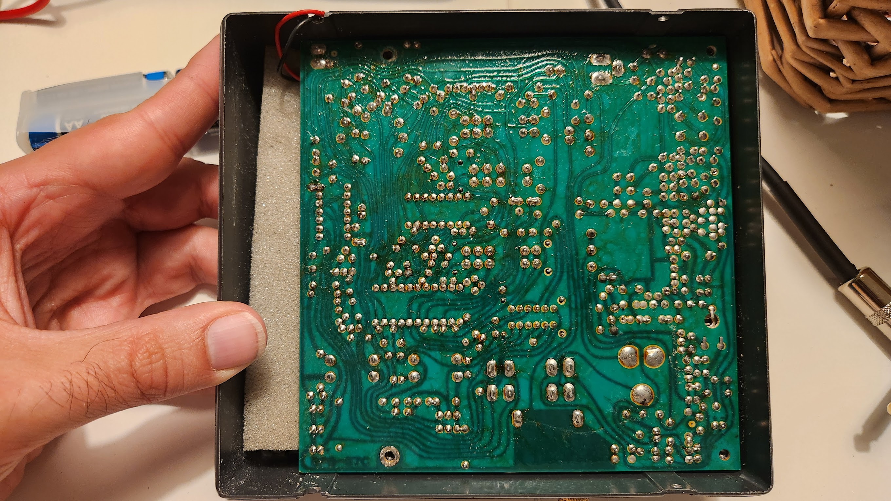
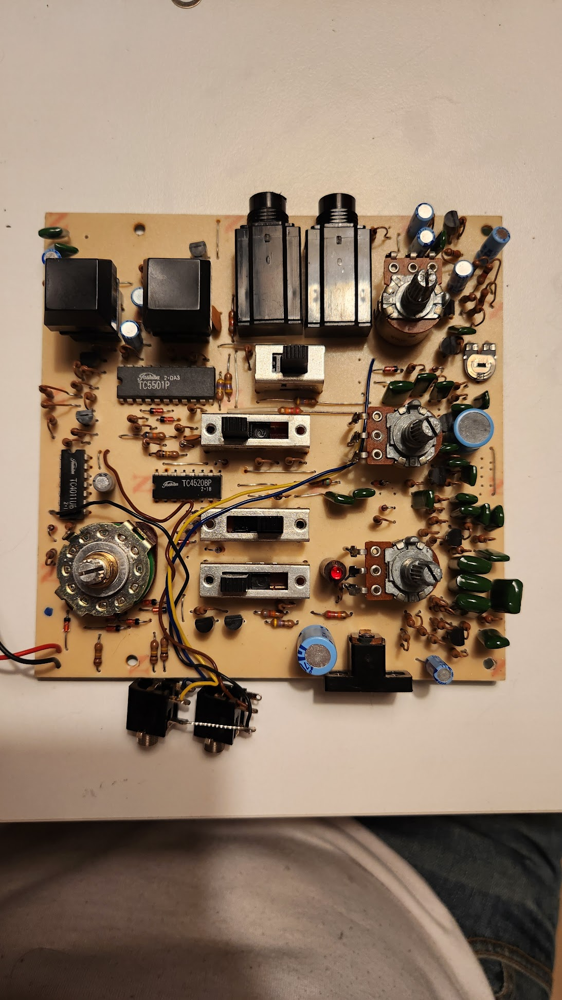
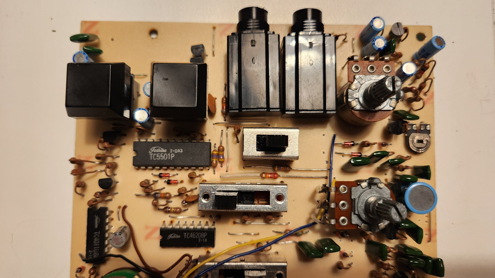
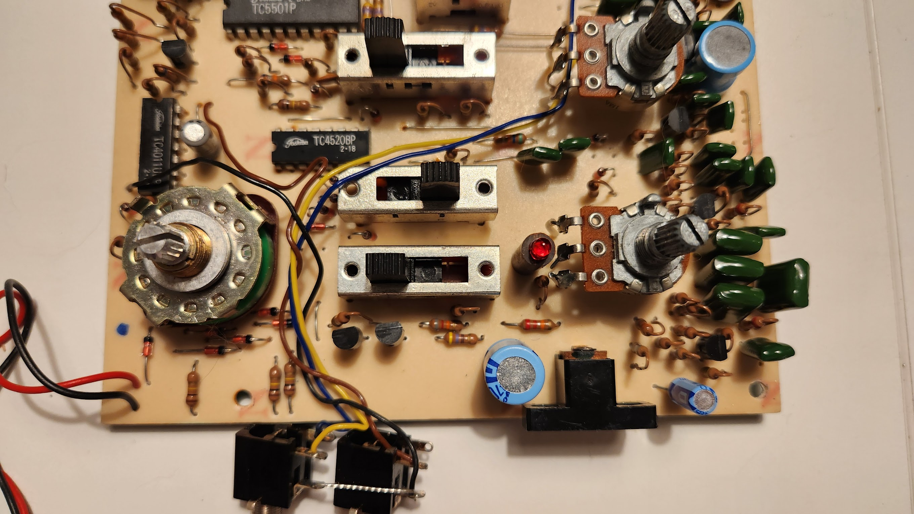
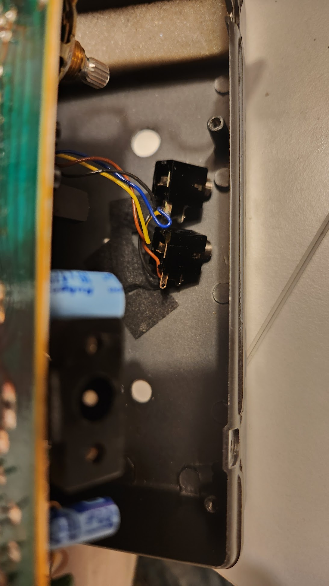



# Overview 

The Sound Master SR-88 is a vintage drum machine, which resembles the Boss DR-55.

I have the grey version.

TODO: Which connector is the start/stop pedal?
TODO: Add general photo

## Notes

There are some things to be noted when using this machine:

- Power adapter is 6V center negative

- Output jack must be connected for device to operate.

- LED is not a power led, it shows 1st beat when running

- There is no "factory reset", so it is unlikely that you have the factory presets in your machine. 

## PCB photos

